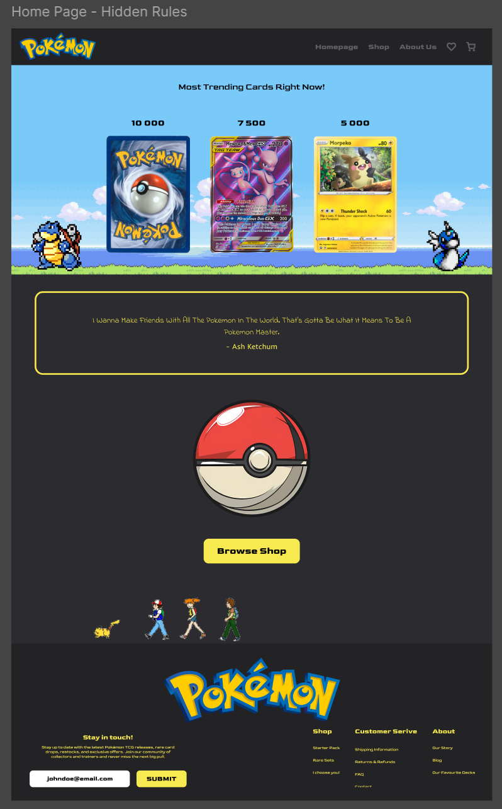
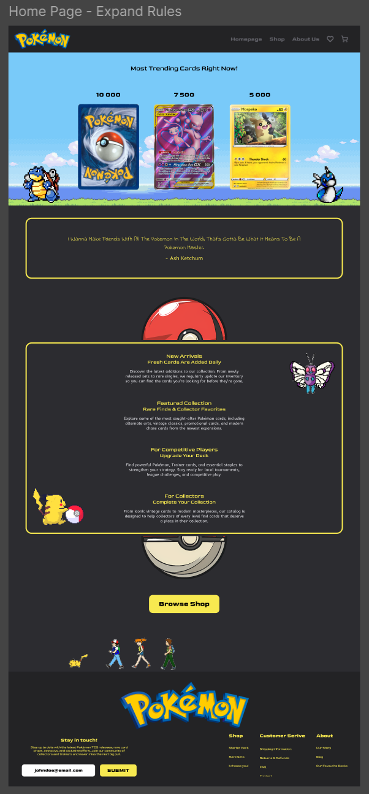
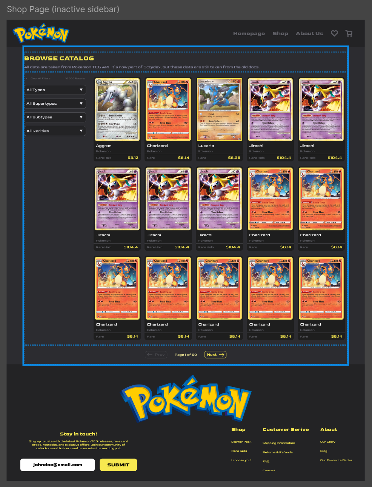
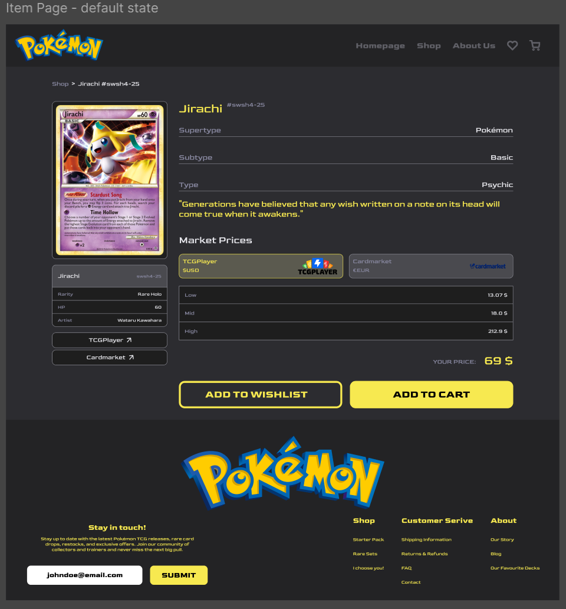

# Shopping Cart - Pokémon

A simple "E-Shop" website following The Odin Project curriculum.
Project instructions can be found [here](https://www.theodinproject.com/lessons/node-path-react-new-shopping-cart)

## Figma

The Pokémon Shop is designed in Figma: [Pokemon Shopping Cart](https://www.figma.com/design/H9y352ZqfiJ0fRHFuFdF3Y/Pokemon-Shopping-Cart?node-id=1-2&p=f&t=Ct1uBDPZvE5kH48D-0)

## Project Structure

The Pokémon Shopping Cart is structured accordingly:

### Homepage

Homepage default state:

Homepage expanded info:

### Shop

Shop page with items - 25 cards per page

### Item

### About Us

//TODO

### Wishlist

//TODO

### Cart

//TODO
